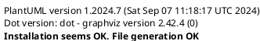
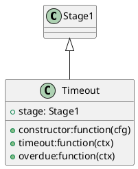

# Introduction
gitbookお試し

## Install
```sh
$ brew cask install calibre
$ yarn global add gitbook-cli
```

## Setting
[Configuration · GitBook Toolchain Documentation](https://toolchain.gitbook.com/config.html)

```json:book.json
{
    "title": "My Book",
    "author": "Author",

    "plugins": [
        "katex"
    ],
    "pluginsConfig": {
    }
}
```

## Pulugins
[Plugins for GitBook](https://plugins.gitbook.com/)

### katex
Inline math: $$\int_{-\infty}^\infty g(x) dx$$


Block math:

$$
\int_{-\infty}^\infty g(x) dx
$$



